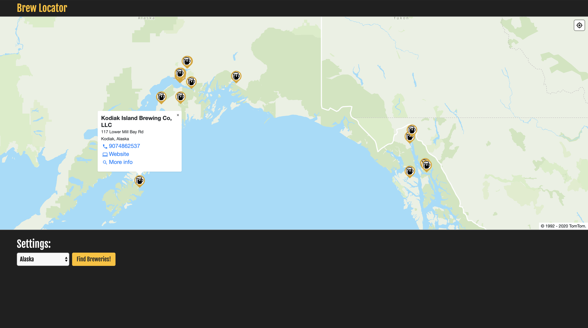

## Brew Locator

Integrates TomTom maps SDK with OpenBreweryDB API to deliver an interactive map of nearby breweries.

### Note:
Current implementation is slow due to large data import from API and displaying of all results at once. Future features will allow user to filter breweries by state and/or radius of current gps location.

