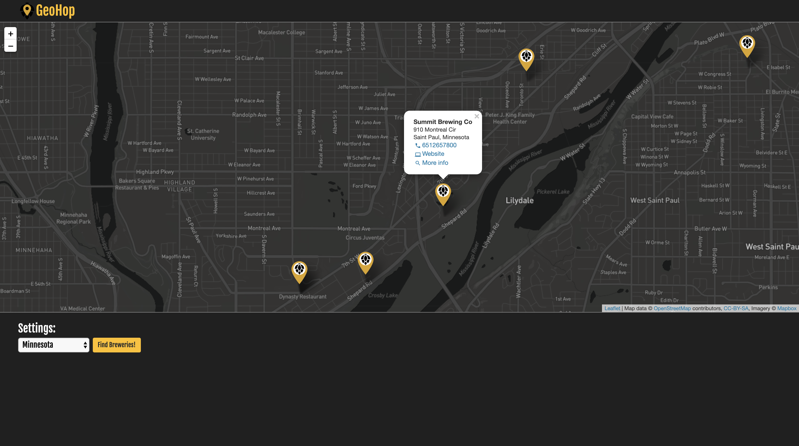

### Development Notice:
Current live implementation (`master` branch) is a basic MVP that allows user to select state (e.g. 'Minnesota') and display breweries in that state.

Check out `geolocation_plus` branch for new features under development, most notably one which allows user to search for breweries within a given radius of their geolocation.

# Brew Locator

Integrates [Leaflet.js](https://leafletjs.com/) with [OpenBreweryDB API](https://www.openbrewerydb.org/) to deliver an interactive map of breweries by location.

## Key Dependencies
 - Leaflet.js
 - Mapbox
 - React
 - Redux
 - OpenBreweryDB
 - Bootstrap

## Usage
Check out the [live demo](https://geohop.herokuapp.com) on Heroku.
(This is hosted on a free dyno, which goes to sleep after a period of inactivity. If the app doesn't load on first try, reload the page).

Alternatively, to clone the respository and run the app via a live development server:

```bash
git clone https://github.com/jgullickson/brew_locator.git
cd brew_locator
npm install
npm start
```

