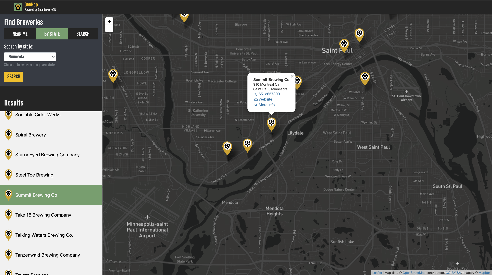
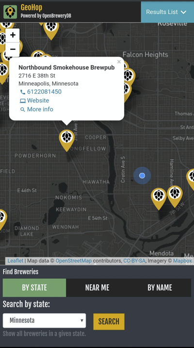

### Development Notes:
This branch adds new features which allow users to search for breweries within a radius of their geolocation, among other features and restyling/refactoring. Leverages Mapbox reverse geocoding API and Turf.js. See screenshots / clone and run locally for preview.

# Brew Locator

Integrates [Leaflet.js](https://leafletjs.com/) with [OpenBreweryDB API](https://www.openbrewerydb.org/) to deliver an interactive map of breweries by location.

## Key Dependencies
 - Leaflet.js
 - Mapbox
 - React
 - Redux
 - OpenBreweryDB
 - Bootstrap
 - Turf.js

## Usage
<!-- Check out the [live demo](https://geohop.herokuapp.com) on Heroku.
(This is hosted on a free dyno, which goes to sleep after a period of inactivity. If the app doesn't load on first try, reload the page). -->

<!-- Alternatively, to clone the respository and run the app via a live development server: -->

```bash
git clone https://github.com/jgullickson/brew_locator.git
cd brew_locator
npm install
npm start
```



